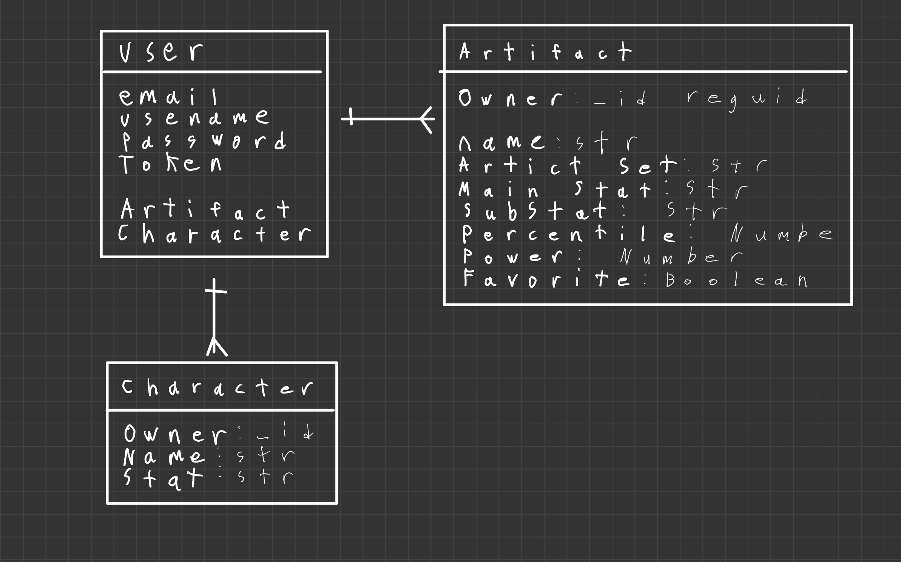

# To be used in conjuction with Genshin Artifact Calculator
https://github.com/mcguirto/Genshin-Artifact-Calculator-Server.git

# Genshin Impact Artifact Calculator
A helper app for the popular video game Genshin Impact. An important part of Genshin's endgame is farming for "artifacts", which can be powered up to semi-randomly increase their stats. Having artifacts that roll the proper stats can be extremely helpful for a player, but since there are several layers of randomness, it can sometimes be difficult to tell exactly how good one artifact is compared to another.

The Artifact Rater aims to make it easier to compare different artifacts by allowing users to upload screenshots of their artifacts and assigning each uploaded artifact two ratings: a percentile rating describing how good the artifact is compared to all possible other artifacts of the same type, and a relative power rating describing how good the artifact is compared to the best possible artifact of that type.

### ERD

### Authentication Routes

| Verb   | URI Pattern            | Controller#Action |
|--------|------------------------|-------------------|
| POST   | `/sign-up`             | `users#signup`    |
| POST   | `/sign-in`             | `users#signin`    |
| PATCH  | `/change-password/` | `users#changepw`  |
| DELETE | `/sign-out/`        | `users#signout`   |

### Artifact

| Verb   | URI Pattern            | 
|--------|------------------------|
| POST   | `/artifact`             |
| GET   | `/artifact`               |
| GET   | `/artifact/:id`          |
| PATCH  | `/artifact/:id`       |
| DELETE | `/artifact/:id`       |

### Character

| Verb   | URI Pattern            | 
|--------|------------------------|
| POST   | `/Character`             |
| GET   | `/Character`               |
| GET   | `/Character/:id`          |
| PATCH  | `/Character/:id`       |
| DELETE | `/Character/:id`       |

### Roles
- Manager: Tyson
- Front-End SME: Efrain
- Back-End SME: Fei